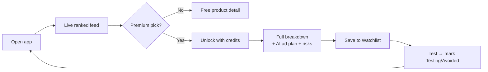
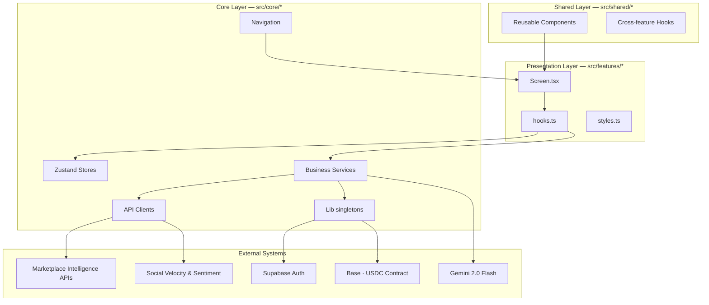
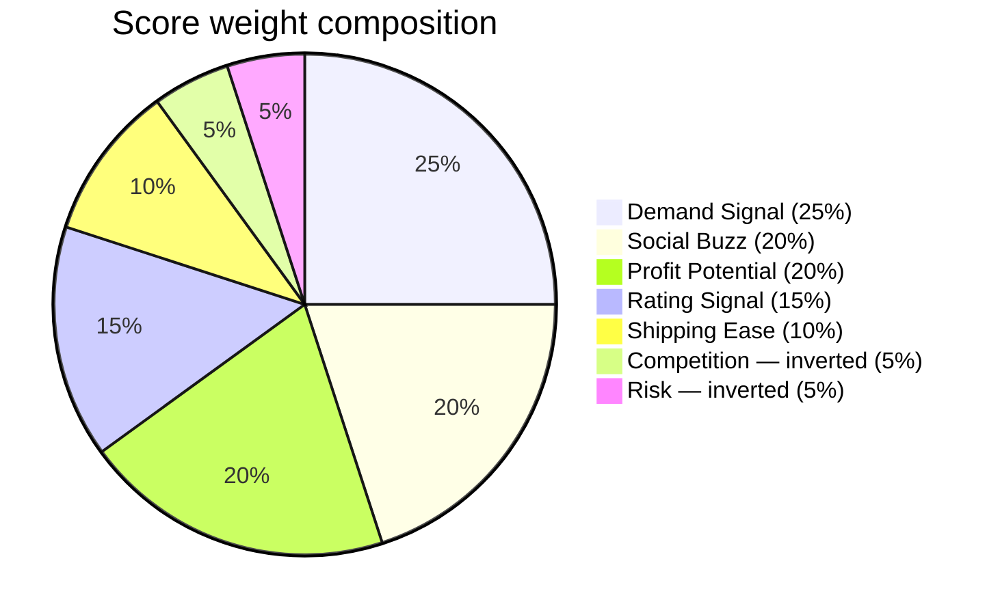

<div align="center">

# 📈 TrendPro

### *AI-powered product intelligence for the next generation of e-commerce sellers.*

**Discover · Score · Compare · Unlock** — winning products before they trend, paid for in stablecoins on Base.

[](https://reactnative.dev)
[](https://www.typescriptlang.org)
[](https://base.org)
[](https://www.circle.com/usdc)
[](#)

[**📖 Full Research Documentation →**](https://www.notion.so/35b85d79bc5081e0a72ef2e8c864171f)

</div>

---

## ✨ Why TrendPro

Solo e-commerce sellers make their highest-leverage decision — *which product to launch next* — by scrolling YouTube gurus, paying $99–$499/mo for desktop SaaS, or guessing. **TrendPro turns product discovery into a scored, ranked, mobile-native experience** with three things competitors don't have:

- 🧠 **A transparent 7-dimension scoring engine** — every score is auditable down to the source signal
- 🪙 **Pay-per-insight micro-payments in USDC** — no subscription, no card on file, sub-cent gas on Base
- 🤖 **AI-generated launch playbooks** — Gemini 2.0 Flash writes the ad copy, audience profile, and test plan when you unlock a product

> Built as a **production-shaped React Native CLI app** — not a prototype. 200+ TypeScript modules, strict type safety, design system, animation contract, multi-source data pipeline, and a real on-chain payment rail.

---

## 🎯 The Core Loop



**Discover → Score → Unlock → Test.** Every feature in the product compresses time-to-decision.

---

## 🚀 Feature Highlights

### Product Intelligence
- **7-Dimension Winning Score** — Demand · Social Buzz · Profit · Rating · Shipping · Competition · Risk → 0–100 composite, 1–10 user-facing rating
- **Live marketplace data** with multi-source fallback (zero downtime even with API outages)
- **Animated dashboard** — credit balance card, metric counters, Market Pulse carousel, Top Opportunity card
- **Trending feed** with category/recommendation/premium-only filters and sort by score, margin, or social buzz
- **Discover surface** with live search, recent queries, trending chips, category-driven browse
- **Product Detail** — image carousel, pricing & margin grid, animated score bars, AI summary, *why trending*, risks, audience profile, ad angles
- **Score Breakdown** — every dimension explained: weight, raw value, normalized score, narrative
- **Compare** up to 3 products side-by-side, with an AI-written conclusion picking a winner
- **AI Test Plan** — target audience, ad angle, ad copy, budget, duration, success metric

### Premium Lock System
| Rating | Unlock cost |
|---|---|
| **9 / 10** | 3 credits |
| **10 / 10** | 5 credits |

Locked sections show blurred previews; insufficient balance routes seamlessly to **Buy Credits**.

### Web3 Credit Economy
| Mode | Badge | What happens |
|---|---|---|
| **Mock (Demo)** | 🟡 USDC DEMO MODE | ~1.4s simulated latency, fake `0x…` hash — works on simulator |
| **Base Sepolia Testnet** | 🟢 BASE SEPOLIA TESTNET | Real ERC-20 USDC transfer via WalletConnect v2, on-chain receipt polling |

**One-line toggle in `App.tsx`:**
```ts
const USE_MOCK_PAYMENT = true;   // false → real on-chain settlement
```

**Credit packages**

| Package | Credits | Bonus | Total | USDC |
|---|---:|---:|---:|---:|
| Starter | 5 | — | 5 | 4 |
| Pro ⭐ | 12 | +3 | 15 | 9 |
| Elite | 25 | +10 | 35 | 15 |
| Power | 60 | +30 | 90 | 28 |
| Monthly Pass | 25 / mo | — | 25 | 19 |

### Operational Surfaces
- **Watchlist** — Watching / Testing / Avoided statuses, persisted across sessions
- **Transaction History** — every USDC purchase and credit unlock with full audit trail
- **Investor Metrics** — on-chain volume, transaction count, treasury balance
- **Onboarding · Profile · Settings · Notifications · Auth** — full account surface

---

## 🛠️ Tech Stack

| Layer | Choice | Why |
|---|---|---|
| **Framework** | React Native 0.74 (bare CLI) | Native performance, no Expo lock-in |
| **Language** | TypeScript 5.3 (strict) | Type safety as the primary correctness gate |
| **Navigation** | React Navigation 6 — Stack + Tab + Drawer | Composable, deep-link-ready |
| **State** | Zustand 4.5 + AsyncStorage `persist` | 1KB, no provider, persistence built-in |
| **Server state** | React Query v5 | Cache, dedup, stale-while-revalidate |
| **Animation** | Reanimated 3 + Gesture Handler | UI-thread animations, 60 FPS contract |
| **Auth** | Supabase | Email/password + session persistence |
| **Web3** | wagmi 3 + viem 2 + WalletConnect v2 + Web3Modal | Type-safe contract calls, mobile-first wallet UX |
| **Chain** | Base Sepolia (Chain ID 84532) | L2, sub-cent gas, USDC-native |
| **Stablecoin** | USDC (Circle official) | USD-pegged, regulated, recognized |
| **AI** | Google Gemini 2.0 Flash | Narrative insights + ad copy at scale |
| **UI primitives** | React Native Paper · Linear Gradient · BlurView · MCI Icons | Polished out of the box |

---

## 🏗️ Architecture



### Data Flow — single product, end-to-end

```
Marketplace Intelligence + Social Velocity + Community Sentiment
  └─▶ productService.ts        — orchestrates sources, dedupes, normalizes, caches
        └─▶ scoringService.ts  — buildScore(product, signals) → ScoredProduct (pure fn)
              └─▶ useProductStore (Zustand) — single source of truth
                    └─▶ useProductsQuery (React Query) — cache reader, never writes
                          └─▶ Screens
```

> **Architectural rule:** screens are JSX-only; logic lives in `[Name].hooks.ts`; `StyleSheet.create` lives in `[Name].styles.ts`. Every feature folder has the same shape.

---

## 📁 Folder Structure

```
plans/                          # Feature implementation plans (one .md per feature)
src/
├── features/                   # 🎬 Presentation — one folder per screen
│   ├── dashboard/
│   │   ├── DashboardScreen.tsx       # JSX only
│   │   ├── Dashboard.hooks.ts        # state + effects
│   │   ├── Dashboard.styles.ts       # StyleSheet only
│   │   └── index.ts                  # re-export
│   ├── trending/
│   ├── discover/
│   ├── product-detail/
│   ├── score-breakdown/
│   ├── compare-products/
│   ├── product-test-plan/
│   ├── watchlist/
│   ├── analytics/
│   ├── investor-metrics/
│   ├── notifications/
│   ├── profile/
│   ├── settings/
│   ├── onboarding/
│   ├── auth/{login,signup}/
│   └── credits/{buy-credits,transaction-history,payment-success}/
│
├── shared/                     # 🧩 Reusable across features
│   ├── components/                   # 24 atoms & molecules (kebab-case folders)
│   │   ├── app-button/
│   │   ├── product-card/
│   │   ├── score-bar/
│   │   ├── search-bar/
│   │   ├── skeletons/
│   │   └── …
│   └── hooks/
│       ├── usePaginatedList.ts       # mandatory for any list >20 items
│       └── queries/                  # React Query hooks
│
├── core/                       # ⚙️ App-level wiring + side effects
│   ├── navigation/                   # Navigator definitions
│   ├── stores/                       # Zustand stores (one per domain)
│   ├── services/                     # Business logic
│   ├── api/                          # Raw fetch clients
│   ├── config/                       # wagmi.ts, web3modal
│   └── lib/                          # supabase singleton
│
├── theme/                      # 🎨 Design tokens (colors, spacing, typography, responsive)
├── constants/                  # App-wide magic numbers / strings
├── types/                      # Global TS types
├── mocks/                      # Bundled curated dataset
└── utils/                      # Pure utility functions

App.tsx                         # Root — payment mode toggle lives here
index.js                        # Entry point — polyfills
```

### Path aliases (no `../../` ever)

| Alias | Resolves to |
|---|---|
| `@features/*` | `src/features/*` |
| `@shared/*` | `src/shared/*` |
| `@core/*` | `src/core/*` |
| `@theme/*` | `src/theme/*` |
| `@hooks/*` | `src/hooks/*` |
| `@utils/*` | `src/utils/*` |
| `@constants` | `src/constants/index.ts` |
| `@mocks/*` | `src/mocks/*` |
| `@t/*` | `src/types/*` |

---

## 📡 Data Sources

The intelligence pipeline blends **four catalog sources + two social signals + one generative layer** so no single outage breaks the product.

| Source | Domain | Required? | Fallback |
|---|---|---|---|
| **Real-Time Marketplace Intelligence API** (Amazon via RapidAPI) | Live best-sellers, deals, search | Live mode only | Falls back to next source |
| **Major Retail Network API** (Best Buy) | Mainstream electronics & home | No | Skip silently |
| **Open E-commerce Catalog Service** | Broad SKU coverage | No | Skip silently |
| **Public Retail Directory API** | General catalog | No | Skip silently |
| **Social Velocity Engine** (YouTube Data API v3) | Search-volume + view-velocity | No | Category-median estimate |
| **Community Sentiment Pipeline** (Reddit) | Trending posts, comment velocity | No | Category-median estimate |
| **Generative Insights Engine** (Gemini 2.0 Flash) | Narrative summaries, ad copy | No | Static template fallback |
| **Curated Hero Set** (bundled dataset) | Demo-grade products always available | Always loaded | n/a |

---

## 🧠 The Scoring Engine



```
score_total  =  Σ ( normalized[d] × weight[d] )
score_total  ∈  [0, 100]
```

**Conversion to user-facing rating:**

| Score | Rating | Premium? | Unlock cost |
|---|---|---|---|
| ≥ 90 | 10 / 10 | ✅ | 5 credits |
| ≥ 80 | 9 / 10 | ✅ | 3 credits |
| ≥ 70 | 8 / 10 | — | Free |
| ≥ 60 | 7 / 10 | — | Free |

> **Why a transparent linear model over ML?** Trust beats accuracy at this stage — a user who can read the breakdown trusts the product. Scoring is also deterministic, free, and auditable. We revisit when we have 90 days of unlock-to-outcome telemetry.

---

## 🧭 Navigation

```
AppNavigator (Stack)
  ├── Onboarding (until useSettingsStore.onboardingComplete)
  └── MainApp → RootStackNavigator (Stack)
        ├── DrawerRoot → DrawerNavigator
        │     ├── BottomTabNavigator (Dashboard · Trending · Discover · Watchlist · Credits)
        │     └── Analytics · Profile · Settings · Notifications
        ├── ProductDetail
        ├── ScoreBreakdown
        ├── CompareProducts
        ├── ProductTestPlan
        ├── InvestorMetrics
        └── PaymentSuccess (modal)
```

---

## 🪙 Smart Contracts & Addresses

| Item | Value |
|---|---|
| **Network** | Base Sepolia (Chain ID 84532) |
| **RPC** | `https://base-sepolia-rpc.publicnode.com` |
| **USDC Contract** | `0x036CbD53842c5426634e7929541eC2318f3dCF7e` |
| **Treasury Wallet** | `0x10Bc9282030dd5a2CF4c7D0fc88e3ad2Ef894C24` |

---

## ⚡ Quick Start

```bash
# 1. Install JS dependencies
yarn install

# 2. Install iOS native pods
cd ios && LANG=en_US.UTF-8 pod install && cd ..

# 3. Start Metro
yarn start --reset-cache

# 4. Run on simulator (separate terminal)
yarn ios
# or:  yarn android
```

> **This is a bare React Native CLI project**, despite legacy mentions of Expo. Use `yarn ios` / `yarn android` — *never* `expo start`.
> **iOS minimum deployment:** 14.0 (required by `@react-native-community/netinfo` v12).

### Quality Gates

```bash
yarn ts:check      # primary correctness gate — must pass
yarn lint          # ESLint — no new errors
```

---

## 🔐 Environment Variables

Create a `.env` in the project root:

```bash
# WalletConnect — required for real testnet payments
EXPO_PUBLIC_WALLETCONNECT_PROJECT_ID="your_project_id"          # cloud.walletconnect.com (free)

# Supabase — required for auth
EXPO_PUBLIC_SUPABASE_URL="https://your-project.supabase.co"
EXPO_PUBLIC_SUPABASE_ANON_KEY="your_anon_key"

# Optional — degrade gracefully if absent
EXPO_PUBLIC_RAPIDAPI_KEY="your_rapidapi_key"
EXPO_PUBLIC_YOUTUBE_API_KEY="your_youtube_key"
EXPO_PUBLIC_GEMINI_API_KEY="your_gemini_key"

# Payment mode
EXPO_PUBLIC_USE_MOCK_PAYMENT=true   # false = real Base Sepolia USDC
```

Always restart Metro with `yarn start --reset-cache` after editing `.env`.

---

## 💳 Payment Modes

### Mock (Simulator / Demo)
1. Set `USE_MOCK_PAYMENT = true` in `App.tsx`
2. Open **Credits** tab → confirm amber **USDC DEMO MODE** badge
3. Pick a package → tap **Pay X USDC**
4. ~1.4s → **PaymentSuccess** with fake `0x…` hash
5. Credits added instantly, transaction logged

### Real Base Sepolia Testnet (Physical Device)

**Prerequisites**
- iPhone with MetaMask / Rainbow / any WalletConnect v2 wallet
- Wallet on **Base Sepolia** network
- Free testnet USDC from [Base Sepolia faucet](https://faucet.circle.com)
- Valid `EXPO_PUBLIC_WALLETCONNECT_PROJECT_ID` in `.env`

```bash
# App.tsx: const USE_MOCK_PAYMENT = false;
yarn start --reset-cache
yarn ios --device
```

1. Credits tab → green **BASE SEPOLIA TESTNET** badge
2. Tap **Connect Wallet** → scan QR / deep-link to MetaMask
3. Pick package → tap pay → sign in MetaMask
4. ~9s on-chain confirmation → verify on [Base Sepolia Explorer](https://sepolia.basescan.org)

---

## 🛡️ Engineering Practices

This codebase ships with **eleven Claude Code skills** that encode review rules as automated reviewers. The rules are deliberately strict and deliberately enforced:

- 🚫 **No raw pixel values** — every dimension goes through `ms()`, `s()`, or `vs()`
- 🚫 **No raw hex colors** — import semantic tokens from `@theme/colors` only
- 🚫 **No relative `../../` imports** — `@alias/` system everywhere
- 🚫 **No FlatList >20 items without `usePaginatedList`** — pagination is mandatory
- 🚫 **No logic in `*Screen.tsx`** — state and effects live in `*.hooks.ts`
- 🚫 **No `console.log` outside `__DEV__`**
- ✅ **Every feature has a plan file** at `plans/<slug>.md` before/alongside the code
- ✅ **TypeScript strict mode is the primary test** — `yarn ts:check` must pass

### Available skills

| Skill | Purpose |
|---|---|
| `/ui-review` · `/component-gen` · `/theme-audit` · `/auth-form` | UI quality |
| `/score-tune` · `/api-debug` · `/mock-data` | Data layer |
| `/perf-audit` · `/feature-plan` · `/code-review` | Quality & planning |

---

## 🔭 Roadmap

### Days 1–30 — Polish & Observability
- [ ] TestFlight + Play Internal Testing
- [ ] Sentry for crash & error reporting
- [ ] PostHog funnel analytics (install → first unlock → second unlock)
- [ ] Mainnet migration plan + treasury rotation procedure
- [ ] Pricing experiment: 3-credit vs 4-credit unlock for 9/10 products

### Days 31–60 — Web3 Maturity
- [ ] In-app fiat onramp (Coinbase Onramp / MoonPay)
- [ ] Apple Pay & Google Pay alongside USDC
- [ ] Gasless unlocks via Base Paymaster
- [ ] Recurring credit packs with auto-top-up

### Days 61–90 — Data Foundation
- [ ] Signal snapshot service — every product, every signal, every 24h, persisted
- [ ] **8th scoring dimension: Trend Velocity** (7-day rate-of-change of social buzz)
- [ ] Outcome telemetry: one-tap *worked* / *flopped* survey 30 days post-unlock
- [ ] First public research blog: *"What 10,000 unlocks taught us about scoring trending products"*

### 2027 — The Network Moat
- Verified outcomes layer (anonymized "I tested this, here's the ROAS")
- Credit rebates for users who submit verified outcomes
- Web companion + public scoring API
- Marketplace partnerships (Shopify, Amazon agencies, TikTok Shop)

> Full strategic thesis, model-moat plan, and risk register: see the [research documentation](https://www.notion.so/35b85d79bc5081e0a72ef2e8c864171f).

---

## ✅ Production Checklist

- [ ] Replace client-side payment verification with backend-confirmed receipts (server must verify before granting credits — never trust client)
- [ ] Move treasury to a multisig wallet
- [ ] Switch from Base Sepolia → Base Mainnet (`src/core/config/wagmi.ts` + constants)
- [ ] Server-side Supabase RLS policies on credit balances
- [ ] Push notification backend (store is local-only in MVP)
- [ ] Connect live Gemini API key in production environment

---

## 🤝 Contributing

1. Fork → feature branch
2. `yarn ts:check` — must pass before any PR
3. `yarn lint` — no new errors
4. Create a plan file at `plans/<feature-slug>.md` for any change touching ≥ 3 files
5. Theme tokens only — no raw hex, no raw px
6. Wrap any `console.*` in `if (__DEV__)`

---

## 📚 Documentation

- **[📖 Engineering & Product Research Brief](https://www.notion.so/35b85d79bc5081e0a72ef2e8c864171f)** — 11-chapter Notion deep-dive with architecture diagrams, scoring math, data pipeline, payment sequence, and 12-month roadmap
- **`plans/`** — per-feature implementation plans
- **`CLAUDE.md`** — codebase guidance for AI-assisted development

---

<div align="center">

**Built for a hackathon. Architected to grow into a real product.**

*Discover the next winning product. Score it. Unlock it. Test it. Repeat.*

</div>
